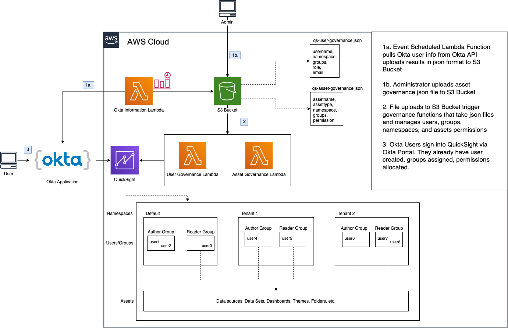

# QuickSight Governance

## Centrally manage QuickSight Namespaces, Groups, Users, and Assets while integrating with Okta

---

## Table of Contents

### 1. About

### 2. Architecture

### 3. Deployment and Set Up

### 4. Usage

### 5. Extended Learning

---

## 1. About

The Goal: QuickSight permissions are controlled entirely by Okta user attributes. QuickSight implements multi-tenancy. User/Asset governance is centralized and automated to prevent administrators from manually creating everything in the console or command-line.

The Solution: Utilize Okta API and AWS Lambda to routinely pull user information from Okta and store relevant information in a user-manifest file.  Allow Administrators to create and manage a single asset-manifest file.  QuickSight Namespaces, Groups, Users and Asset permissions are managed entirely via these two manifest files.

---

## 2. Architecture



### Relevant Okta User Profile Information Mapping (Subject to Change)

Okta -> QuickSight
username -> Username
organization -> Namespace
department -> Groups
userType -> Role
email -> Email

---

## 3. Guide

### a. Set up Okta Application

- Sign in to your Okta admin dashboard. You can create a free Okta Developer Edition account.
- From the Okta admin dashboard ribbon, choose **Applications**.
- If you are viewing the Developer Console, switch to **Classic UI**.
- Choose **Add Application**.
- Search for Amazon Web Services and choose **Add**.
- Rename Application label to Amazon QuickSight and choose **Next**.
- For Sign-On Options, choose **SAML 2.0**.
- For Default Relay State, type **https://quicksight.aws.amazon.com**.
- Right-click on **Identity Provider metadata** and choose **Save Link As…**
- Save the XML file to disk and choose **Done**. You need to use this file in the next steps.

### b. Set up AWS Okta IDP

Create a SAML provider in AWS

- Open a new window and sign in to the AWS Management Console.
- Open the IAM console.
- In the navigation pane, choose **Identity Providers**, **Create Provider**.
- For Provider Type, choose **SAML** and provide a Provider Name (for example, OktaIDP).
- For Metadata Document, upload the XML file from the previous steps.
- Choose **Next Step**, **Create**.
- Locate the IdP that you just created and make note of the Provider ARN

### c. Create the Secrets Manager Secret

- Sign in to the AWS Secrets Manager console at https://console.aws.amazon.com/secretsmanager/
- Choose **Store a new secret**.
- Select **Other type of secrets**
- Add Secret Key/Value pairs for each of the following Okta Information. You can find this information in your Okta account.

example:

| Secret Key | Secret Value |
|------------|--------------|
|okta-app-id-secret | abcdefghij0123456789 |
|okta-app-token-secret | abcdefghij0123456789abcdefghij0123456789ab |
|okta-account-id-secret | dev-012344567 |

- click **Next**
- provide Secret Name as **okta_info**
- click **Next**, **Store**

### d. Prepare the CDK

- in the directory of this repository, navigate to **cdk_modules/config.py**
- update the config file with information related to your AWS account: (Account ID, Region, OKTA IDP, Secret)

### e. Deploy the CDK

- ensure your session is valid and you are using the correct AWS account profile.
- in the command line, run **cdk deploy**

### f. Create an AWS access key for Okta

To create an access key for Okta, follow these steps.

- Open the IAM console.
- Navigate to Users -> OktaSSOUser -> Security Credentials -> Create Access Key
- To save your access key and secret key, choose Download .csv.

### g. Configure the Okta application

#### Update SAML Attributes

- Return to the window with your Okta Application.
- First, we’ll need to set up the Okta Application with attributes and attribute mapping.
- Attributes are specified under the Sign On tab.

ex.

https://aws.amazon.com/SAML/Attributes/PrincipalTag:userType (user.userType)
https://aws.amazon.com/SAML/Attributes/PrincipalTag:organization (user.organization)
https://aws.amazon.com/SAML/Attributes/PrincipalTag:department (user.department)

Ensure that TransitiveTagKeys is appropriate set. This allows tag values to transfer across assumed Roles.

https://aws.amazon.com/SAML/Attributes/TransitiveTagKeys ({"userType", "organization", "department"})

#### Update IDP Arn

- For Identity Provider ARN (Required only for SAML SSO), provide the ARN (for example, arn:aws:iam::<YOUR ACCOUNT ID>:saml-provider/OktaIDP) of the IdP that you created in previous steps.
- Choose Done.

#### Update API Integration

- From the Applications dashboard, choose Provisioning.
- Choose Configure API Integration.
- Select Enable API Integration.
- For Access Key and Secret Key, provide the access key and secret key that you downloaded in previous steps.
- Choose Test API Credentials, Save.

#### Update User Attribute Mapping

- From the SETTINGS left pane, navigate to To App.
- Choose Edit.
- Enable Create Users and Update User Attributes and choose Save.
- Select Go to Profile Editor, Add Attributes.
- Select Mappings and ensure that you are mapping attributes from Okta → AWS Account Federation

#### Assign Users to App

- Choose Assignments, Assign and then select the users or groups to which to grant federated access.
- Select the Roles and SAML User Roles to grant to the users, as shown in the following screenshot.
- Choose Save and Go Back, Done.

## 4. Usage


### User Governance

After the CDK is deployed, a GetOktaInfo Lambda Function will run on a fixed schedule, getting information from Okta and configuring/placing it in S3.

#### Example User Governance - qs-user-governance.json

```json
{
    "Users":[
       {
          "username":"user1@gmail.com",
          "namespace":"default",
          "groups":"default_authors",
          "role":"AUTHOR",
          "email":"user1@gmail.com"
       },
       {
          "username":"user2@gmail.com",
          "namespace":"default",
          "groups":"default_readers",
          "role":"READER",
          "email":"user2@gmail.com"
       }
    ]
 }
```

### Asset Governance

As for Asset Governance, an Administrator will need to upload a JSON file to the QSGovernance S3 Bucket. The Assets that the Administrator specifies (Datasets, Dashboards, Themes, Analyses, etc) will need to be created in QuickSight prior.

#### Example Asset Governance - qs-asset-governance.json

```json
{
    "Assets":[
       {
            "name": "table_a",
            "category":"Dataset",
            "namespace":"default",
            "group":"default_authors",
            "permission": "READ"
       },
       {
            "name": "table_b",
            "category":"Dataset",
            "namespace":"default",
            "group":"default_readers",
            "permission": "READ"
       }
    ]
 }
```

---

## 5. Extended Learning

### Cross-Account QuickSight Access

- 
- 
- 

### QuickSight Namespaces

- 
- 
- 

### QuickSight + Okta

- 
- 
- 

### Okta Attribute Mapping

- 
- 
- 

### Okta API Usage

- 
- 